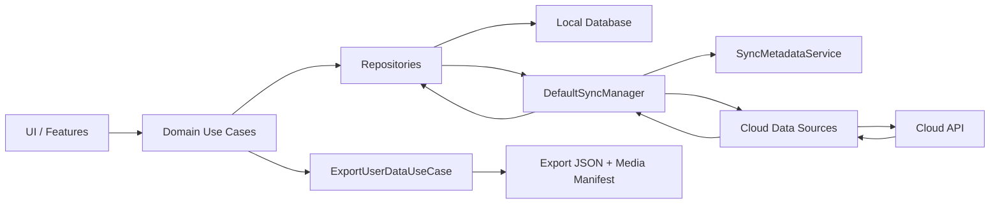
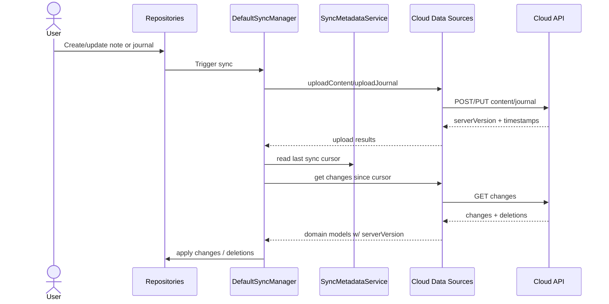
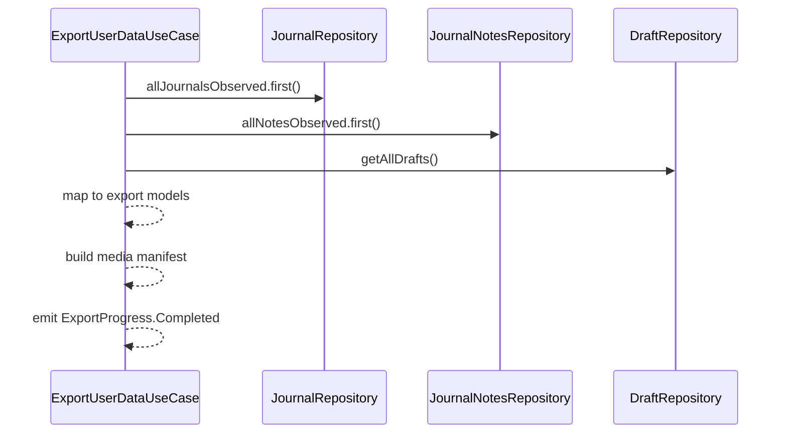

# Backup and Sync Architecture

This document describes how backup/export and sync work across the LogDate monorepo. It covers the system at a high level, then drills into the concrete data flows and components used in the current implementation.

## Scope

- Backup/export of user data (journals, notes, drafts, media references).
- Cloud sync of journals, notes, and journal-content associations.
- Local-first storage and sync metadata tracking.

## High-level architecture

LogDate is local-first. The app persists data in the local database via repositories and uses a sync manager to reconcile local changes with the cloud API. Export/backup is driven by a domain use case that reads from repositories and produces a portable JSON + media manifest.

## Core components

- `JournalRepository` and `JournalNotesRepository` are the local-first entry points for content.
- `JournalContentRepository` manages journal ↔ content associations.
- `DefaultSyncManager` orchestrates uploads/downloads for journals, notes, and associations.
- `Cloud*DataSource` layers translate between domain models and API payloads.
- `SyncMetadataService` persists per-entity pending uploads and sync cursors.
- `ExportUserDataUseCase` assembles a snapshot for backup and portability.

## Code map (monorepo)

- `client/sync`: `DefaultSyncManager`, cloud data sources, sync metadata service, sync models.
- `client/data`: offline-first repositories and outbox enqueueing (`SyncMetadataService` integration).
- `client/domain`: export flow and sync orchestration use cases.
- `client/database`: DAOs for journals/notes and sync metadata persistence.
- `shared/model`: sync payloads and shared entities with `syncVersion`.
- `server`: `/api/v1/sync/*` routes, `SyncRepository` implementations.

## Low-level data model

- `Journal` and `JournalNote` now include `syncVersion` so API payloads can include the last known server version.
- `JournalContentAssociation` includes `syncVersion` for association uploads and change reconciliation.
- `SyncMetadataService` persists:
  - pending uploads per entity type and ID
  - a cursor timestamp per entity type for incremental downloads

## Sync flow (upload + download)

### Upload (local → cloud)

1. Local changes are written to the database via repositories.
2. The repositories trigger `DefaultSyncManager` (content or association sync) after writes.
3. `DefaultSyncManager` uploads journals, notes, and associations via the cloud data sources.
4. The cloud layer includes `syncVersion` in upload/update requests.

### Download (cloud → local)

1. `DefaultSyncManager` reads the last sync cursor for each entity type.
2. It requests deltas from the cloud API since that cursor.
3. Responses are mapped into domain models with `syncVersion = serverVersion`.
4. Local repositories apply changes and resolve conflicts with configured resolvers.
5. Remote deletions are skipped if local edits are pending or newer than the last sync cursor.

## Backup/export flow

Export is a pure read path that uses repositories as sources of truth. It is deterministic and produces a portable JSON set plus a media manifest.

## Data safety guarantees

- Local-first writes are always persisted before any sync runs.
- Remote deletions are skipped if local edits are pending or if local `lastUpdated` is newer than the last sync cursor.
- Export includes:
  - journals, notes, drafts
  - unique media references with deterministic export paths
- Draft export includes media references from all block types (text, image, video, audio, camera).

## Observability and diagnostics

- `SyncResult` carries success, error details, and counts for uploads/downloads.
- `SyncMetadataService` exposes pending upload counts for UI status.
- Export exposes progress via a flow to support UI progress indicators.

## Testing overview

- Sync tests cover uploads, downloads, error handling, conflict resolution, and deletion safety.
- Export tests cover progress emissions, metadata correctness, and media de-duplication.
- Data repository tests validate local persistence and querying behavior.

## Open follow-ups

- Add end-to-end sync tests against a real cloud backend.
- Implement richer conflict resolution strategies beyond LWW.
- Extend export/import into a full round-trip restore flow.
